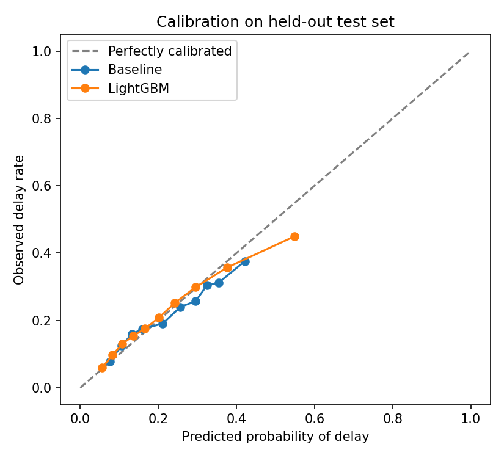
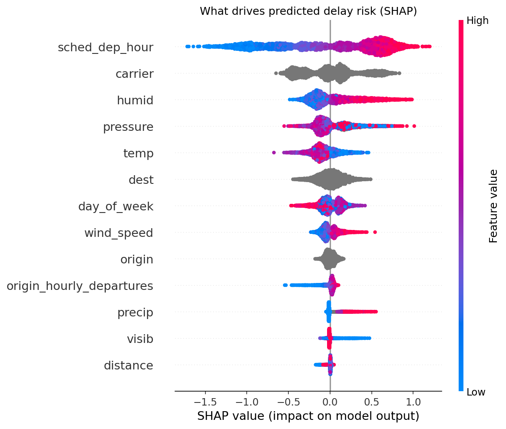

# Flight Delay Prediction with Responsible ML

Predicting whether a scheduled flight will depart 15+ minutes late, built the way I would want a model to be built in a regulated organisation: time-based validation, a credible baseline, automated data quality checks, explainability, segment-level performance review, drift monitoring, and a model card generated from the results.


## Why this project
Delay risk drives many airport decisions: stand allocation, staffing, gate changes and passenger communications. Getting the prediction right matters less than building it in a way that is trustworthy, explainable and governable. This repo focuses on both.

## Results (held-out test set: Nov-Dec 2013, 54,145 flights)

| Metric | Historical-rate baseline | LightGBM |
|---|---|---|
| ROC AUC | 0.648 | **0.693** |
| PR AUC | 0.314 | **0.386** |
| Brier score (lower is better) | 0.164 | **0.157** |

The model ranks delay risk better than the baseline (+0.05 AUC, +23% PR AUC) and is well calibrated across most of the probability range. That is a modest lift, which is expected: the dataset has no inbound-aircraft (reactionary) delay, the largest real-world driver. Full details are in the **[model card](MODEL_CARD.md)**.

## What the responsible-ML checks found
- **Drift would already trigger a review.** Temperature has a PSI of 4.3 between training (Jan-Sep) and test (Nov-Dec), because the model is applying summer-learned weather patterns to winter. A monthly PSI monitor would catch this before performance degraded silently.
- **Performance is uneven across carriers.** The model under-predicts Southwest (WN) delays by about 8 percentage points, so that carrier's delay risk would be systematically understated in any resourcing decision built on it.
- **Explanations are operationally plausible.** SHAP shows scheduled hour as the strongest driver (delays build through the day), followed by carrier and humidity/pressure (weather systems).
- **No leakage.** Only information available before departure is used, enforced by a data quality check and a unit test.

| Calibration | What drives predictions (SHAP) |
|---|---|
|  |  |

## Approach
1. **Data:** [`nycflights13`](https://github.com/tidyverse/nycflights13): 336,776 departures from New York's three airports in 2013, joined to hourly airport weather. Open data, no personal data.
2. **Quality assurance:** automated checks for duplicates, target validity, value ranges, weather-join coverage, missingness and leakage. The pipeline stops on any critical failure.
3. **Validation design:** train Jan-Sep, tune on Oct, test once on Nov-Dec. Never a random split, which would leak same-day disruption across train and test.
4. **Models:** a historical delay-rate baseline (origin x hour) vs LightGBM with early stopping.
5. **Evaluation:** ROC AUC, PR AUC, Brier score, calibration, and performance by airport and carrier.
6. **Explainability and monitoring:** SHAP global importance, Population Stability Index per feature.
7. **Documentation:** `MODEL_CARD.md` is regenerated on every run, so it cannot fall out of date with the model.

## Run it
```bash
pip install -r requirements.txt
python run_pipeline.py   # ~1 minute; writes outputs/ and MODEL_CARD.md
pytest                   # unit tests on synthetic data
```

## Project structure
```
run_pipeline.py            End-to-end pipeline
src/flightdelay/
  config.py                Thresholds, time split and feature list in one place
  data.py                  Loading, feature engineering, time-based split
  quality.py               Data quality checks with a pass/fail report
  models.py                Baseline and LightGBM
  evaluate.py              Metrics, calibration, segment performance, PSI drift
  explain.py               SHAP explainability
  report.py                Model card generator
tests/                     Unit tests (leakage, split integrity, PSI, edge cases)
outputs/                   Metrics, segment tables, drift report, figures
MODEL_CARD.md              Generated model documentation
```

## Limitations and next steps
- Uses **observed** weather; a live system would only have forecasts. Next step: train on archived forecasts.
- Add **reactionary delay** features (inbound aircraft delay via tail number), the biggest missing signal.
- Set the decision threshold from the **operational cost** of missed delays vs false alarms, not F1.
- Retest after removing or re-engineering drifting weather features, and compare stability.

## Author
**Eriola Trungu Impersimi**, Operational Researcher (GORS). [LinkedIn](https://www.linkedin.com/in/eriola-trungu-impersimi/)
